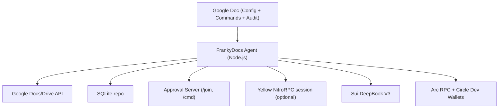

# FrankyDocs - Complete Project Explanation

## One-line pitch
FrankyDocs turns a Google Doc into a multi-chain DeFi treasury. Anyone who can type in a spreadsheet can trade, pay, and manage crypto without installing a wallet. Signers approve in a browser.

Note: the codebase uses the internal name "DocWallet" in env vars, template anchors, and the ENS policy key `docwallet.policy`.

---

## Problem
Web3 treasury tooling is not usable for normal teams:

| Pain point | Reality |
| --- | --- |
| Wallet UX | Install a wallet, manage seed phrases, switch networks, approve gas |
| Team treasury | Multi-sig flows require every signer to install extensions and understand gas |
| Multi-chain | Different wallets and UIs per chain |
| Compliance | No clear audit trail for who approved what and when |
| DeFi access | Placing limit orders on DeepBook needs CLI tools or custom code |

Result: most teams do not use DeFi for real treasury operations.

---

## Solution
FrankyDocs is an agent that lives in Google Docs. It:

1. Watches a shared Google Doc for commands typed by team members.
2. Parses `DW ...` commands and validates them.
3. Enforces policy (ENS text record `docwallet.policy`).
4. Collects approvals through a browser-based approval UI.
5. Executes on-chain actions (Sui DeepBook, Arc, Circle).
6. Writes back results and audit log entries into the same doc.

Proposers do not need a wallet. Signers approve using MetaMask or delegated keys (Yellow).
Chat suggestions are non-executing; use `!execute` in Chat to insert a command into the Commands table.

---

## Architecture


---

## How it works in this repo

### 1) Google Doc template and tables
The agent inserts a template into the Doc (Config, Commands, Chat, Balances, Open Orders, Recent Activity, Sessions, Audit Log).
The Config table includes approval metrics (`APPROVALS_TOTAL`, `EST_APPROVAL_TX_AVOIDED`) and toggles (`AGENT_AUTOPROPOSE`, `DOC_CELL_APPROVALS`).

Relevant code:
- `src/google/template.ts`
- `src/google/docwallet.ts`

### 2) Polling and command ingestion
The engine polls docs on an interval, reads the Commands table, parses new rows, and creates approval URLs.

Relevant code:
- `src/index.ts`
- `src/engine.ts`
- `src/core/commands.ts`

### 3) Approvals
The approval server runs locally, serves `/join` for signer registration, and `/cmd` for approval. Approvals are recorded in SQLite and visible in the Doc.

The approval UI also summarizes the action, shows quorum progress, and displays gasless impact metrics (approvals avoided and estimated gas saved) driven by Config rows like `APPROVALS_TOTAL` and `SIGNER_APPROVAL_GAS_PAID`.
For demo-only flows, status-cell approvals can be enabled with `DOC_CELL_APPROVALS=1` in the Config table.

Relevant code:
- `src/server.ts`
- `src/db/repo.ts`
- `src/db/schema.ts`

### 4) Execution
Once quorum is met, commands move to EXECUTING and are executed through integrations:
- Sui DeepBook V3 via PTBs (`src/integrations/deepbook.ts`)
- Arc payouts via RPC (`src/integrations/arc.ts`)
- Circle dev-controlled wallets (`src/integrations/circle.ts`)
- ENS policy read (`src/integrations/ens.ts`)

---

## Autonomous agent decision engine (implemented today)
Every 60s the agent runs decision checks and logs to Recent Activity:

- Stale command alerting: commands pending for more than 1 hour
- Sui gas check
- Balance threshold alerts (`DW ALERT` / `DW ALERT_THRESHOLD`)
- Idle capital detection for Circle wallet balances
- Auto-rebalance flag check (alerts only)
- Auto-proposals when enabled: `DW SESSION_CREATE` if Yellow is on but no session, and `DW POLICY ENS <name>` if policy is not set

Relevant code:
- `src/engine.ts` (`agentDecisionTick()`)

The agent also records decisions in the `agent_activity` table in SQLite for auditability.
Auto-proposals are recorded as `AGENT_PROPOSAL` in the Recent Activity table and update `LAST_PROPOSAL` in the Config table.

---

## Yellow Network integration (optional, implemented)
Yellow is used to create a NitroRPC app session and submit off-chain state updates when quorum approvals are met.

Flow:
1. Signers join via `/join/<docId>` and authorize delegated session keys.
2. `DW SESSION_CREATE` creates a NitroRPC app session with those delegated keys.
3. When approvals reach quorum, the agent submits `submit_app_state` for the command.
4. `DW SESSION_CLOSE` closes the session.

Relevant code:
- `src/integrations/yellow.ts`
- `src/server.ts` (join flow)
- `src/engine.ts` (session create and submit)

Note: the app session update is off-chain; execution still happens after quorum approvals.

---

## Sui / DeepBook V3 trading (implemented)
Sui is used for trading on DeepBook V3 using PTBs:

- Limit buy/sell, cancel, and settle
- BalanceManager auto-creation on first use
- Coin merge and split handling via PTBs
- Market orders implemented as IOC limit orders at extreme prices

Relevant code:
- `src/integrations/deepbook.ts`
- `src/wallet/sui.ts`

---

## Arc and Circle USDC treasury (implemented)
Arc is the payout rail. Circle developer-controlled wallets are the default path when enabled:

- Wallet creation on Arc testnet
- USDC payouts and split payouts
- Balance polling
- Bridge command uses Circle transfer semantics (best-effort)

Relevant code:
- `src/integrations/arc.ts`
- `src/integrations/circle.ts`

---

## ENS policy enforcement (implemented)
The agent reads `docwallet.policy` from ENS. It enforces limits on:

- `LIMIT_BUY` / `LIMIT_SELL`
- `PAYOUT` / `PAYOUT_SPLIT`
- `SCHEDULE`
- `BRIDGE`

Example policy:
```json
{
  "requireApproval": true,
  "dailyLimitUsdc": 5000,
  "maxSingleTxUsdc": 1000,
  "allowedPairs": ["SUI/USDC"],
  "payoutAllowlist": ["0x0000000000000000000000000000000000000001"],
  "denyCommands": ["BRIDGE"],
  "schedulingAllowed": true,
  "maxScheduleIntervalHours": 24,
  "bridgeAllowed": false
}
```

Relevant code:
- `src/integrations/ens.ts`
- `src/core/policy.ts`

---

## Commands
All supported commands and aliases are listed in `docs/commands.md`.

---

## Security model
- Quorum approvals via signer registry
- Encrypted private keys (AES-256-GCM)
- Audit log and activity feed in the Google Doc
- Optional ENS policy gating
- Optional Yellow delegated keys for off-chain approvals

---

## Sponsor track alignment

### Arc - Build Global Payouts and Treasury Systems with USDC
- Agent-driven payout logic (`PAYOUT`, `PAYOUT_SPLIT`, `SCHEDULE`)
- Treasury managed in USDC on Arc
- Policy-based limits via ENS
- Logged decision making in the doc

### Sui / DeepBook
- Full order lifecycle on DeepBook V3 (limit, market, cancel, settle)
- Sui-native object model and PTBs

### Yellow Network
- NitroRPC app session for gasless approval state updates
- Delegated session keys per signer

---

## Roadmap (explicitly not fully implemented)
- Gas savings counter written into the doc
- Richer risk engine with portfolio-aware recommendations
- More chain support and trading pairs
- Sponsored transactions and passkey approvals
